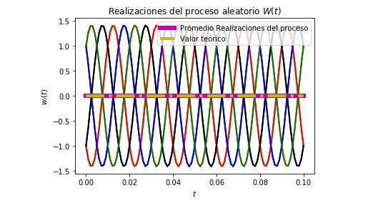

# Proyecto4

# David Alejandro Arguedas Lobo, B40536

# Curso: Modelos probábilisticos de señales y sistemas

# Profesor: Fabian Abarca

Haciendo un análisis de ergodicidad y estacionaridad con la gráfica obtenida , se concluye lo siguiente:

* Al ser el promedio temporal de la muestra (t_m) igual al promedio estadístico del proceso estocástico y al ser estos independientes del tiempo (constante), es decir  solo dependiente de la variable tau. Además que la correlación de la muestra es independiente del tiempo también, podemos decir que es un proceso estacionario y ergodico.

