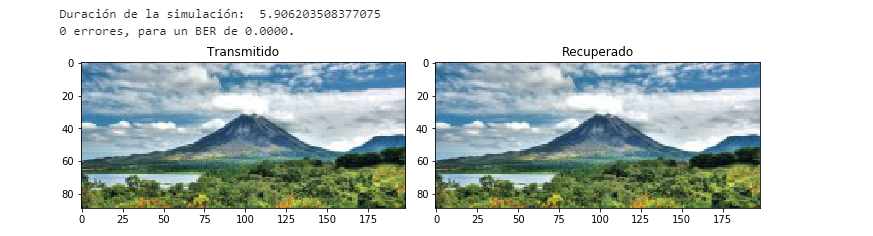
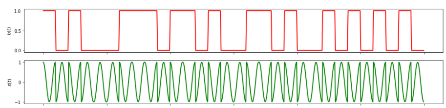
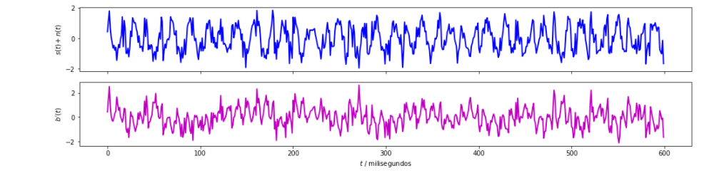
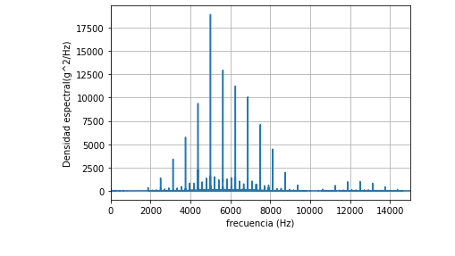

# Proyecto4

# David Alejandro Arguedas Lobo, B40536

# Curso: Modelos probábilisticos de señales y sistemas

# Profesor: Fabian Abarca

Se tienen las siguientes asignaciones:

* (50%) Realice una simulación del sistema de comunicaciones como en la sección 3.2., pero utilizando una modulación QPSK en lugar de una modulación BPSK. Deben mostrarse las imágenes enviadas y recuperadas y las formas de onda.

* (30%) Realice pruebas de estacionaridad y ergodicidad a la señal modulada `senal_Tx` y obtenga conclusiones sobre estas.

Haciendo un análisis de ergodicidad y estacionaridad con la gráfica obtenida , se concluye lo siguiente:

* Al ser el promedio temporal de la muestra (t_m) igual al promedio estadístico del proceso estocástico y al ser estos independientes del tiempo (constante), es decir  solo dependiente de la variable tau. Además que la correlación de la muestra es independiente del tiempo también, podemos decir que es un proceso estacionario y ergodico. 

* (20%) Determine y grafique la densidad espectral de potencia para la señal modulada `senal_Tx`.

